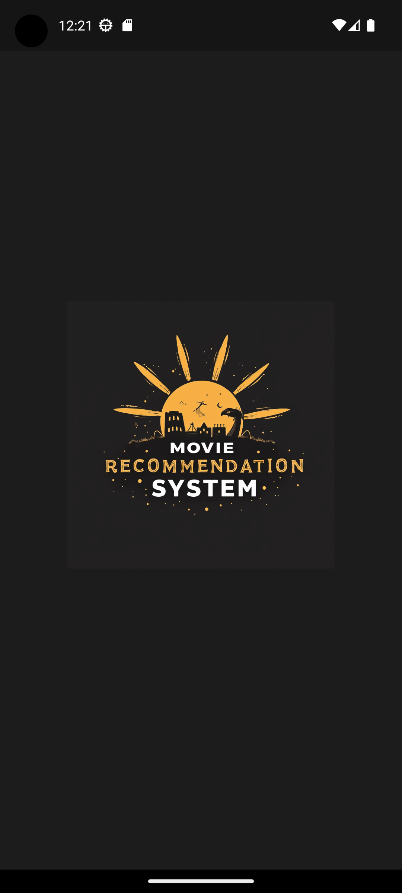

# Movie Recommendation System

A Flutter application that provides movie recommendations based on user diary entries using the Google Gemini API. The app allows users to write their diary entries and get movie suggestions relevant to their mood or thoughts for the day.

## Features
- **Diary Entry Input**: Users can write their daily diary entries.
- **Movie Recommendations**: Get five movie suggestions based on the content of the diary entry using the Gemini API.
- **Clean UI**: Simple and intuitive interface designed for seamless user experience.
- **State Management**: Implemented using the Provider package.

## Screenshots
Here are some screenshots of the application:

### Splash Screen


### Diary Entry Screen


### Enter Data


### Recommendations Screen


## Color Scheme
The application follows a color scheme inspired by the logo:

### Primary Colors
- **Deep Black**: `Color.fromARGB(255, 0, 0, 0)`
- **Golden Yellow**: `Color.fromARGB(255, 255, 180, 0)`
- **Soft Orange**: `Color.fromARGB(255, 255, 140, 0)`
- **Warm White**: `Color.fromARGB(255, 255, 255, 255)`

### Secondary Colors
- **Muted Yellow**: `Color.fromARGB(255, 255, 221, 115)`
- **Dark Gray**: `Color.fromARGB(255, 28, 28, 28)`

## Getting Started

### Prerequisites
- Flutter 3.0.0 or higher
- Dart 3.2.0 or higher
- Google Gemini API Key

### Installation

1. Clone the repository:
    ```bash
    git clone https://github.com/khushalrajoria/Mikki.Ai.git
    cd movie-recommendation-system
    ```

2. Install dependencies:
    ```bash
    flutter pub get
    ```

3. Add your Gemini API Key securely:
    ```bash
    flutter run --dart-define=API_KEY=your_gemini_api_key
    ```

### Running the Application
To run the app on an emulator or connected device, use:
```bash
flutter run --dart-define=API_KEY=your_gemini_api_key
```

### Build APK for Android:
```bash
flutter build apk --dart-define=API_KEY=your_gemini_api_key
```

## Folder Structure

```
lib/
│
├── providers/
│   └── chat_provider.dart    # Handles API integration and state management
│
├── screens/
│   ├── diary_entry_screen.dart   # Screen to write diary entries
│   ├── recommendation_screen.dart  # Screen to show movie recommendations
│   └── splash_screen.dart         # Initial splash screen
│
└── main.dart                      # Main entry point of the application
```

## How It Works
1. The user writes a diary entry on the **Diary Entry Screen**.
2. The application sends the diary entry as a prompt to the Gemini API.
3. The **Recommendation Screen** displays five movie suggestions based on the diary entry.

## Dependencies
- [provider](https://pub.dev/packages/provider): State management
- [google_generative_ai](https://pub.dev/packages/google_generative_ai): For Gemini API integration
- [http](https://pub.dev/packages/http): HTTP requests (if needed)

## Contributing
Feel free to contribute to this project. Open issues to suggest features or report bugs. Make pull requests for any enhancements or bug fixes.

## License
This project is licensed under the MIT License - see the [LICENSE](LICENSE) file for details.
